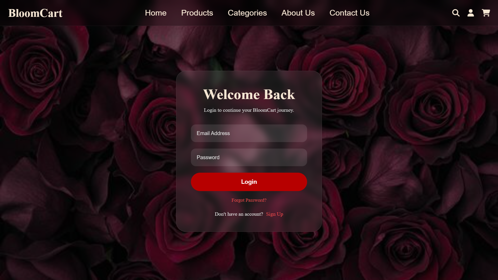
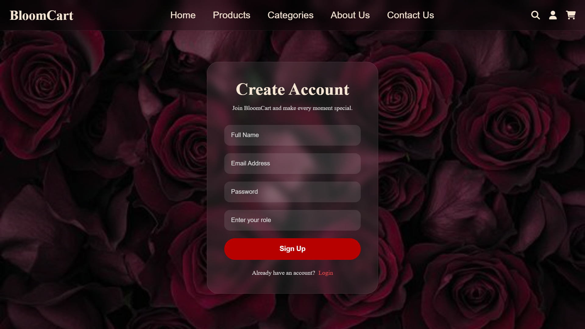
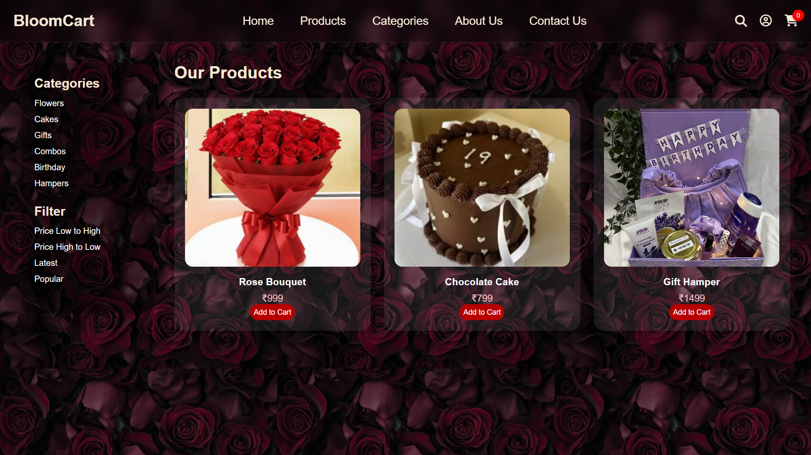
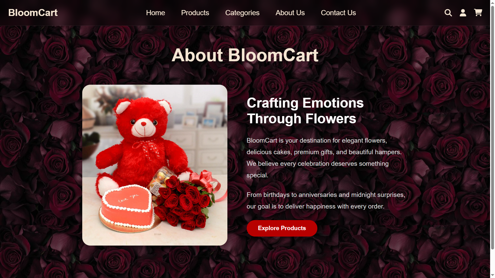
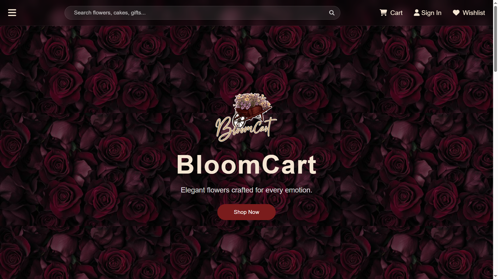
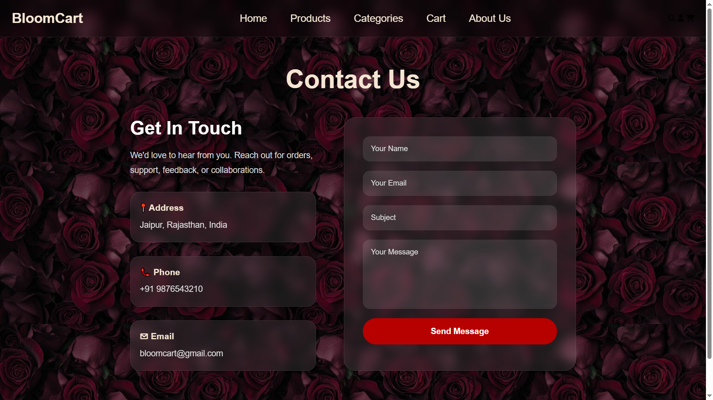

# BloomCart
BloomCart is a full-stack e-commerce web application built using Java, Spring Boot, PostgreSQL, HTML, CSS, and JavaScript. It features user authentication, RESTful APIs, database-driven product management, and frontend-backend integration, showcasing practical full-stack web development concepts.
## 🚀 Features

- User Signup & Login Authentication
- E-commerce Product Listing System
- RESTful API Development using Spring Boot
- PostgreSQL Database Integration
- Dynamic Frontend-Backend Communication
- Product Data Fetching from Database
- Responsive UI using HTML, CSS & JavaScript
- Fetch API Integration for Real-Time Data Handling
- Dockerized Backend
- PostgreSQL Integration
- Docker Compose Multi-Container Setup
- Responsiveness across different screen sizes like phones , tablets , laptops etc.
  
## 🛠️ Tech Stack

### Backend
- Java
- Spring Boot
- Spring Data JPA
- Hibernate
- REST APIs
- Docker containerization
- Docker compose

### Frontend
- HTML5
- CSS3
- JavaScript

### Database
- PostgreSQL

### Tools & Platforms
- Eclipse IDE
- Git & GitHub
- Postman
- Docker desktop
  
## 📂 Project Architecture
BloomCart
│
├── src/main/java
│   ├── controller
│   ├── entity
│   ├── repository
│   └── service
│
├── src/main/resources
│   ├── static
│   │   ├── html
│   │   ├── css
│   │   ├── js
│   │   └── images
│   │
│   └── application.properties
│
└── pom.xml
|__Dockerfile
|__ docker-compose.yml

## 🔗 Core Functionalities

### 👤 Authentication Module
- User Registration
- User Login
- Secure credential handling

### 📦 Product Module
- Fetch products dynamically from database
- Display products using REST APIs
- Product information rendering on frontend

### 🔄 Frontend-Backend Integration
- API communication using JavaScript Fetch API
- Dynamic data rendering
- Real-time interaction between UI and backend

## 📸 Screenshots

### Login Page

### Signup Page

### Products Page

### About Us Page

### Home Page

### Categories Page

### Contact Us Page

## 🧠 Key Learning Outcomes
- Full-stack web application development
- REST API design and integration
- Database connectivity using Spring Boot & MySQL
- Frontend-backend communication
- Dynamic DOM manipulation using JavaScript
- Project structuring and version control using GitHub
- Deployment of projects in real-world
  
## 🚀 Future Enhancements
- Shopping Cart System
- Order Management
- Payment Gateway Integration
- Product Search & Filters
- Admin Dashboard
- JWT Authentication

## 👨‍💻 Author
Developed by Chandanpreet kaur

## ⭐ Repository Highlights

This project demonstrates practical implementation of:
- Full-stack architecture
- RESTful backend development
- Database-driven applications
- Frontend integration
- Real-world e-commerce workflow concepts
- Real-world deployment of projects
- Responsive UI for different screen sizes
